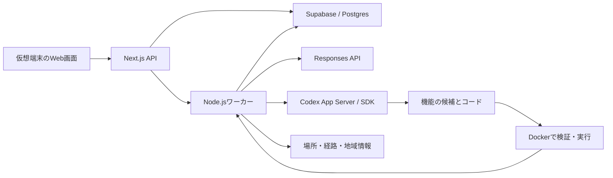

# 育てる地図：Macデモから実装するための詳細仕様書

版：1.0 / 更新日：2026年9月5日\
状態：実装用の設計案。合意した方針と実装の既定案を区別する。アプリの実装・ビルド・実行テストは未実施。

記録と対話から自分の地図が育ち、友人との比較、旅先への提案、Codexによる機能追加、体験後の訂正までを接続する。
今回の完成地点は、Mac上の仮想端末で一連の体験を実演できることである。
画面、API、DB、ワーカーを担当する実装者に向けて記述する。

本文は画面と処理、[データとAPI](docs/spec/データとAPI.md)は保存形式と通信契約、[受入条件と実装順序](docs/spec/受入条件と実装順序.md)は検証例と着手順序を定める。
体験の説明には[デモシナリオ](育てる地図_デモシナリオ.md)、用語には[CONTEXT.md](CONTEXT.md)を使う。
基礎要件は[要件定義v4](育てる地図_要件定義_技術設計_v4.md)であり、端末と完成段階は最新のユーザー方針を反映した本書を優先する。
実装者は本書の1〜4節で対象をつかみ、付録の実装順序に従って該当する処理とAPIを読む。
利用者の操作と判定規則は本書、保存する型・状態名・API契約は「データとAPI」、合否の判定は「受入条件と実装順序」を正本とする。
契約を変更するときは、対応する画面説明と受入条件も同じ変更で更新する。

## 1. Macで全機能を接続し、実機への導入は追加段階に置く

| 区分 | 合意した内容 |
|---|---|
| 機能範囲 | v4の全機能と例外処理。デモで見せることを最優先にする |
| 完成地点 | Mac上のシミュレーター／エミュレーターで通しデモ。スマホ実機は余力がある場合 |
| 省電力 | 今回の訴求・合格条件にしない。独自最適化や電池比較を前提にしない |
| 地域 | 開催地、東京、名古屋、避暑地を候補にする。街区と避暑地は未確定 |
| 位置記録 | 既存SDKを再利用する方針。今回のデモは再生入力を使い、実機の背景記録は追加段階 |

### 1.1 実装の既定案

以下は今回具体化した設計案であり、未回答の事項を合意済みとして扱うものではない。
素材と接続先を差し替えても、共通の保存・比較・提案が動く構成にする。

| 項目 | 既定案 | 差し替える条件 |
|---|---|---|
| デモ画面 | Next.jsのWeb画面をiOS SimulatorのSafariで操作する | 仮想端末の準備や描画確認に問題があればAndroid Emulatorを検証する |
| ネイティブ実装 | 初回はWeb画面。SDKとアプリのパッケージ化は実機段階 | 背景記録へ進むとき |
| 保存と認証 | Mac内のSupabaseローカル環境。Postgres、PostGIS、Auth、Storage | 外部の参加者へ配布するとき |
| 人物 | デモ用A・B。体験は架空と表示する | 本人と友人の実体験が提供されたとき |
| 操作権 | A・Bの利用者操作と発表者用のデモ管理操作を分ける | 外部公開の利用者・運用担当が決まったとき |
| 避暑地 | データの確認候補として箱根を使う | 本人が別の地域を選んだとき |
| 最初の追加機能 | 寄り道5分以内の休憩場所を探し、追加時間別に色分けする | デモの見せ場として別の要求を選んだとき |

Safari上のWeb表示と、ネイティブアプリのビルド済み状態は区別して報告する。
ブラウザの表示幅を変えただけで、仮想端末での確認を完了扱いにしない。

### 1.2 今回の完成条件

| ID | 必須の機能 | 接続して示す変化 |
|---|---|---|
| F01 | 記録と対話 | 用途・理由が保存され、次の質問へ使われる |
| F02 | 共有と比較 | 同じ場所の異なる用途、異なる場所の共通用途が分かる |
| F03 | 視点と体験の移し替え | 相手の目線と自分向けで候補・経路・説明が変わる |
| F04 | Codexによる機能追加 | 要求、実装、検証、プレビュー、有効化まで進む |
| F05 | 感想と訂正 | 解釈と次の比較・提案が更新され、訂正が保持される |
| F06 | 地域情報 | 普段の道との重なりを出典と時刻を伴って示す |
| F07 | 情報取得の修復 | 失敗検知、修復候補、独立した検証、復旧まで進む |

3D表示、階の区別、共有取消、機能の共有・複製・変更・復帰、各機能の例外処理も対象とする。
位置記録の再生を認める一方、回答の保存、比較、提案、生成コードの検証と有効化は実際の処理として動かす。
実API、入力の再生、保存済み結果の表示は別々に記録する。
実GPS、日常の背景記録、実機への導入、ストア配布、一般向けホスティングは追加段階へ置く。

## 2. 画面・保存・長い処理をMac上で接続する

最初の保存確認は、デモ領域作成、記録再生、位置の保存、地図への表示をつなぐ。
APIでは`demo/runs → demo/replays → observations/batches → GET /map`に当たり、AIなしでも再送・再開を検証できる。
並行して外部APIの最小接続を確認し、M2以降で対話・比較・提案へつなぐ。再現入力だけで実APIの確認を完了扱いにしない。

| 実行単位 | 責務 |
|---|---|
| `apps/web` | 地図、下部パネル、会話、比較、プレビュー、通常API |
| `apps/worker` | 会話、比較、経路探索、機能生成、情報更新、再計算 |
| `packages/contracts` | APIとジョブの入力・出力、JSON Schema、検証関数 |
| `packages/domain` | 根拠、訂正、権限、比較と評価の規則 |
| `packages/map` | 建物、軌跡、レイヤー、比較選択の描画 |
| `packages/integrations` | OpenAI、Codex、経路、地理データ、情報源の接続 |
| `supabase` | マイグレーション、DB権限、認証、Storage |
| `fixtures` | 二人の体験、再生ログ、取得失敗、独立した期待値 |

Webは`127.0.0.1:3000`、ワーカーの内部受付は`127.0.0.1:3100`を既定とする。
ブラウザは同じWebオリジンのAPIを使い、Codexやワーカーへ直接接続しない。
秘密情報をフロントエンドや生成コードへ渡さない。
外部APIを使うため、Mac内で動くこととオフラインで完結することは別の条件である。

### 2.1 手元の環境と固定する版

2026年9月5日の確認では、MacはM1 Max・64GB、Node.jsは22.22.1、pnpmは9.15.9である。
Dockerは29.2.0でdaemonも稼働している。
Codex CLIは0.153.2を確認した。Xcode、iOS Simulator、Android SDKと仮想端末は標準の配置場所では確認できていない。
アプリのコードと依存定義は、この仕様書の作成開始時点では存在しない。

Next.js 16系、React 19系、MapLibre GL JS 6系、deck.gl 9系を既存の技術選定案から引き継ぐ。
組合せをビルドしてから依存の正確な版を固定し、Codexの通信型も同じCLIの版から生成する。
mapcnは地図UIの部品として取り込み、画面構成は本書に合わせる。
Supabaseローカル環境はCLIとDockerで起動する。開発用の構成を外部へ公開しない。[Supabaseのローカル開発](https://supabase.com/docs/guides/local-development/cli-workflows)

## 3. 地域と体験素材を差し替え可能にする

| 地域ID | 初期データを確認する範囲の案 | 役割 |
|---|---|---|
| `yokohama` | 新山下・元町・山下公園 | 会場付近で相手の視点を試す |
| `tokyo` | 隅田川・蔵前周辺 | Aの河川敷の体験を具体化する |
| `nagoya` | 栄・久屋大通周辺 | Bの本屋と東京の用途を比較する |
| `resort` | 箱根・芦ノ湖周辺 | 環境の違う場所へ体験を移す |

街区は実装用の候補であり、ユーザーによる確定ではない。
地域のmanifestに範囲、取得元URL、取得日、版、帰属表示、座標系、ファイルとチェックサムを残す。
施設・道路・入口・歩行経路は実データで確認し、静けさや座れることには個別の根拠を付ける。

初期素材はA・Bそれぞれ3〜5か所の関係、各1本以上の散歩、比較の4類型を各1件以上とする。
提案先には条件で順位が変わる候補、条件を満たせない候補、情報不足の候補を用意する。
建物高さの実データによる確認と、階情報の欠落を再現するテストを分ける。
位置の再生は時刻付きの共通JSONを標準とし、GPXも同じ形式へ変換する。
時刻を補った場合は合成であることを保持する。

## 4. 地図の選択と操作パネルを全画面で共有する

| ID | URL | 主要な操作 |
|---|---|---|
| S01 | `/` | 発表者の初回ログイン、デモ用A・Bの選択、履歴なしの利用開始 |
| S02 | `/map` | 自分の地図、場所・経路・階の選択、記憶の編集 |
| S03 | `/map?panel=conversation` | 対象について話す、質問を後回し・スキップ |
| S04 | `/map?panel=compare` | 相手・期間・用途、重ね合わせ、対応カード |
| S05 | `/map?panel=transfer` | 視点・条件、旅先の候補・経路の比較 |
| S06 | `/map?panel=features` | 機能の作成、プレビュー、有効化、共有、複製、復帰 |
| S07 | `/map?panel=feedback` | 感想、見送った理由、解釈の訂正 |
| S08 | `/map?panel=sources` | 地域情報の出典・時刻・取得状態 |
| S09 | `/builds/:jobId` | 発表者が生成の進行、変更、検証結果、確認要求を読む |
| S10 | `/demo` | 発表者が場面を開始、再生を操作、失敗入力へ切替 |

人物切替とデータ初期化はローカルの`DEMO_MODE`限定とする。
表示名だけを変えず、別の認証セッションを発行する。
同時に二人を見せる場合はブラウザプロファイル等でセッションを分離する。

基準サイズは390×844 CSS px。上部に街・期間・相手、中央に地図、下部に「地図／比較／提案／機能」を置く。
下部パネルは閉じた状態・半分・全体の3段階とし、キーボードで送信欄を隠さない。
幅1024px以上では操作欄を横へ出し、別都市の比較には二つの地図を並べる。

共有する画面状態は`regionId, camera, selection, panel, comparisonId, transferId, enabledFeatureIds`とする。
選択は場所・経路・階・比較ペアのいずれか一つで、対象名を会話欄にも表示する。
入力途中で選択を変えた場合は下書きを元の対象へ保持し、送信時に対象IDと版を固定する。
戻る操作で保存済みの会話を削除しない。
ロード中・データなし・情報不足・更新失敗を区別し、色とラベルを併用する。

## 5. 位置記録を根拠として保存し、訪問と分ける

F01は位置記録、本人が選んだ訪問・経路、写真、メモ、会話を入力として扱う。
原記録は追記で保持し、軌跡と訪問候補を別に作る。

### 5.1 再生と軌跡

再生は開始・一時停止・再開・終了を持ち、速度は1倍・10倍・60倍を既定とする。
位置ごとに時刻、座標、精度、入力元、元記録IDを保存し、同じIDの再送で訪問数を増やさない。
取込み順が前後しても観測時刻と連番で軌跡を構成する。

初期値は`max_gap_seconds=120`、`max_accuracy_m=50`、`max_segment_speed_mps=12`とする。
これらは再現テストの設計値であり、実際の測位精度を保証する値ではない。
閾値を超える区間や精度が不明な区間は分断し、通行済みとして補完しない。
記録点の線と、道路に沿って計算した経路は別データとする。

### 5.2 訪問候補と本人確認

有効な記録点の精度円と施設の形状が重なる場合、その施設を訪問先の候補に含める。
同じ施設を候補に含む2点以上が120秒以上続き、間に軌跡の分断がないとき、訪問候補を生成する。
候補が一つなら`place_id`に保存し、複数なら`place_id=null`と候補一覧を保存する。
点だけの施設も候補には含めるが、内部への訪問は位置だけで確定しない。
短い訪問や記録のない訪問は本人の申告から追加できる。

`candidate → confirmed / rejected`を基本とし、「ここで過ごした」という回答など明示的な根拠で確定する。
位置だけでは訪問を自動確定しない。
通過は有効な軌跡から表現し、訪問候補と同じ状態列へ押し込まない。
写真も補助的な根拠として扱い、写った建物や階を自動的に訪問済みにしない。
履歴がなくても場所を選んで話せる。記憶を語ったことと、現在の訪問記録があることは区別する。

## 6. 対話から用途と理由を取り出し、次の質問へ渡す

会話は場所・経路・体験・比較ペアのいずれかに結び付ける。
本人の原文を先に保存し、Responses APIで用途、理由、適用条件、確認すべき仮説を抽出する。
構造化出力をJSON Schemaで受け取り、対象ID、根拠、権限、適用範囲をアプリでも検証する。[OpenAIの構造化出力](https://developers.openai.com/api/docs/guides/structured-outputs)

1. 対象、権限、原文、`client_message_id`を検証してメッセージを保存する。
2. 閲覧可能な関係、訂正、会話を集め、参照IDと版を固定する。
3. AIの出力を検証し、本人の説明の抽出と補った仮説を分ける。
4. 公開直前に権限と参照版を再確認し、変更があれば再計算する。
5. 関係の更新、応答、次の質問、派生データの更新通知を保存する。

AIが失敗しても原文は残し、解釈を再試行できるようにする。
再試行で原文や関係を重複登録しない。途中のストリーミング表示を確定した解釈として保存しない。

本人が話した用途と理由は発言を根拠とし、発言にない好みは`hypothesis`にする。
傾向を作る初期条件は異なる2体験以上。根拠と未確認の条件を示し、確率として表示しない。
新しい質問は原則1問とし、回答・後で・飛ばすを用意する。
新しい根拠なしに同じ質問を再提示せず、既に答えた理由を無視して最初から聞き直さない。

会話の正本はDBとし、各リクエストで権限を確認した履歴を組み立てる。
共有取消への対応のため、プロバイダー側の過去の会話を無条件に継承しない。
Responses APIは`store: false`を既定とし、モデル、プロンプト版、参照版、使用量、応答IDを記録する。
この設定をプロバイダーによるあらゆる保持がなくなる保証として説明しない。

## 7. 位置の一致と用途の対応を別々に比較する

F02は自分・相手・重ね合わせを切り替え、相手、期間、曜日区分、時間帯、用途で絞る。
共有が許された関係だけを使う。

| 類型 | 判定の材料 | 表示 |
|---|---|---|
| 同じ場所・同じ用途 | 同一場所と根拠付きの用途の対応 | 共通用途とそれぞれの理由 |
| 同じ場所・違う用途 | 同一場所と異なる用途 | 条件と過ごし方の違い |
| 違う場所・同じ用途 | 異なる場所と本人の説明に基づく対応 | 比較カードと双方の地図選択 |
| 相手だけが知る場所 | 自分の記録・説明に対応がない共有情報 | 相手から教わった場所 |

同一性は外部ID、建物、階との対応で管理し、名前の類似だけで場所を統合しない。
初期デモは各人最大50件の関係を対象に、用途の語句による候補抽出後、AIが対応と根拠を返す。
施設種別だけで用途の一致を決めない。
双方の関係IDと版、根拠、共通点、違い、適用条件を保存する。

対応を「合う／違う」で訂正でき、否定した対応を同じ二つの版だけで再生成しない。
新しい回答があれば訂正を引き継いで再検討する。
意味の対応は経路線と異なる記号で示す。

## 8. 場所の役割を保ちながら別の街の経路を探す

F03の入力は元の体験、地域、出発点、時間、歩行距離上限、移動条件、モードである。
体験を目的、役割、順序、理由、必須条件、移せない記憶に分け、利用者が確認・編集してから探索する。

1. 役割ごとに根拠付きの属性から最大5候補を集める。
2. 必須条件を満たせない、または必須条件が未確認の候補を除く。
3. 順序を保つ組合せを最大12件に絞り、歩行経路のAPIへ渡す。
4. 歩行時間と滞在時間、距離、移動条件を検証する。
5. 最大3案を返し、維持した特徴、変更点、未確認の点を示す。

経路はopenrouteserviceの`foot-walking`を既定とする。
階段回避は`avoid_features: ["steps"]`を使い、対応状況と返却経路を確認する。
この設定でバリアフリー全般を保証しない。[openrouteserviceの経路条件](https://giscience.github.io/openrouteservice/api-reference/endpoints/directions/routing-options)
経路を取得できないとき、直線を歩行経路として代用しない。

忠実さと自分への適合は別々に保存する。
忠実さの既定重みは目的40%、役割と順序30%、理由30%。各項目は根拠付きの`0 / 0.5 / 1`、未確認は`null`とする。
同じ分類に複数の評価項目があれば、その分類の重みを等分する。元の体験にない分類は評価対象から外し、残る重みを正規化する。
得点は`Σ(重み × 確認できた評価) / Σ(全評価項目の重み)`、充足率は`Σ(確認できた項目の重み) / Σ(全評価項目の重み)`とする。
未確認の項目も分母に含め、情報不足だけで高得点にならないようにする。評価対象自体がなければ得点と充足率は`null`を返す。

自分への適合も同じ計算式を使い、現在有効な本人の条件を評価する。各条件の重みを1とし、本人が優先と指定した条件だけ2にする。
相手の目線では忠実さ、自分への適合、充足率の高い順、歩行時間の短い順に並べる。自分向けでは先頭の二つを入れ替える。
ある得点が全候補で`null`ならその比較軸を飛ばし、一部だけ`null`なら同じ軸の最下位に置く。最後の同点は経由地ID列の辞書順で決める。
値は順位付け用であり、満足度の確率として表示しない。

候補がなければ`no_candidates`と不足条件を返す。
利用者が変更するまで条件を緩めない。
採用・見送り、理由、経路、参照版を保存し、体験後の感想につなげる。

## 9. 3D表示に経験を重ね、高さと階の根拠を保つ

道路、建物輪郭、水域、主要施設は初期状態から表示する。
軌跡に沿って街を立ち上げても、周辺の建物を訪問済みにはしない。
通過・訪問候補・訪問確認・記憶あり・他者の知識は別属性として組み合わせる。

建物はPLATEAU等の実際の高さを使い、`0 → height_m`のアニメーション後にその高さへ固定する。
訪問回数や好みで最終的な高さを変えない。
高さ不明なら輪郭・平面と「高さ未確認」を表示する。
登場は600msを既定とし、動きを減らす設定では即時表示する。
MapLibreの押し出し高さはメートルで指定する。[MapLibreのレイヤー仕様](https://maplibre.org/maplibre-style-spec/layers/)

地上・地下・上層階は`levels`、入口と上下移動は`level_connections`に保存する。
階の高さが不明なら階選択パネルと平面表示で区別し、階数×一定値を実測形状にしない。
地下は専用の階表示へ切り替え、未対応の負の押し出し高さへ依存しない。
訪れた階、施設の階情報、階の形状・高さには別々の根拠を持たせる。
階不明、入口だけ確認、建物だけ訪問確認を保持できるようにする。

## 10. Codexが追加した機能を版を固定して使う

F04は設定の組合せで足りる要求と、新しいコードが必要な要求を両方扱う。
コード生成の確認例では、変更・検証・実行結果を示す。

機能の版には、入力・出力の形式、情報源、個人データの項目、使う共通操作を持たせる。
更新規則、独立した検証例の集合である検証Suite、コードのハッシュも同じ版に結び付ける。
設定型は検索・絞込み・色分け・順位付けを組み合わせる。
コード型はTypeScriptの`evaluate(input, context)`を追加し、GeoJSON、評価、カード、専用表示用のデータを返す。
初期の設定語彙にない計算・解析・表示をコード型で拡張できる構成にする。

### 10.1 作成・検証・有効化

機能の版は`draft → generating → validating → validated`を基本とし、`awaiting_input / failed / cancelled`も保存する。
プレビューは検証済み版を実行する別ジョブで、有効化は利用者ごとのinstallが参照する版を切り替える操作とする。
画面の「プレビュー可能」「利用中」「旧版」は、版の検証結果、実行結果、installから表示する。別利用者の有効化状態を一つの版のstateへ混ぜない。
失敗した候補で利用中の版を上書きしない。
要求、共通契約、合成した検証データ、変更可能なファイルをCodexへ渡す。
型、入出力Schema、独立した検証例、実行時間、出力量を確認する。
プレビューは同じ入力での追加前後、使うデータ、未確認の条件を示す。
有効化時にハッシュと検証結果を照合し、検証後に変わったコードを登録しない。

無効化は利用者の登録を止める。復帰は検証済みの旧版を、現在の権限と情報源で再確認して切り替える。
共有は処理と条件を対象とし、作者の個人データ、キー、過去の計算結果を含めない。
複製は新しい所有者・機能IDを作り、元の版への参照を残す。

### 10.2 生成コードの実行範囲

生成コードはDockerの専用コンテナで実行する。
直接のネットワーク、DB資格情報、ホストのホーム、Dockerソケットを渡さない。
入力は読取り専用とし、外部情報はワーカーが権限を確認する共通操作を経由する。
利用できる操作は場所検索、経路計算、地域情報、許可された個人データの読取りとする。
記憶の保存や共有変更は通常APIで行い、生成コードへDB管理権限を渡さない。

既定上限はCPU 1コア、メモリ512MiB、CPU時間合計10秒、出力2MiBとする。
共通APIの応答待ちを含む実行全体は90秒、共通操作は1回の実行につき20要求まで、同時実行は2要求までとする。検証処理は120秒を上限とする。
専用表示は`allow-scripts`のみの隔離フレームで動かし、親のCookie・DOMへアクセスさせない。
CSPで外部通信を止め、親子の通信は送信元、実行ごとのnonce、Schemaを検証する。
通常地図への点・線・面の追加は検証済みの描画契約を通す。

### 10.3 初回のコード生成で計算する寄り道時間

入力は選択済みの散歩、座れる根拠を持つ候補地点、追加歩行時間の上限300秒とする。
散歩の線上に最大30個の接続候補点を等間隔で置き、各休憩地点に最も近い候補点を接続点とする。
休憩地点は近い順に最大10件まで調べる。
経路APIで「接続点→休憩地点→同じ接続点」の歩行時間を求め、その往復を追加時間とする。
この探索範囲での候補であり、経路上の全地点について最短の寄り道を保証するものではない。
休憩そのものの滞在時間は追加歩行時間へ含めず、旅程の時間確認では別に加える。

120秒以下、120秒超〜240秒以下、240秒超〜300秒以下を三つの色と時間ラベルで表示する。
到達不能、300秒超、座れる根拠なしの地点は採用せず、除外理由を返す。
この往復時間の計算は初期の設定語彙へ組み込まず、Codexが生成するコードの検証対象にする。
独立した検証例には境界値120・240・300秒、往復不能、休憩の根拠なしを含める。

## 11. Codexの対話とジョブをアプリの状態へ対応させる

対話を伴う機能作成はApp Server、自動の修復ジョブはCodex SDKを使う案とする。
公式資料もこの用途の使い分けを案内している。[Codex App Server](https://learn.chatgpt.com/docs/app-server)、[Codex SDK](https://learn.chatgpt.com/docs/codex-sdk)

ワーカーから`codex app-server`をstdioで起動する。
`initialize → initialized → thread/start → turn/start`の順に接続し、itemの開始・完了、応答差分、turn完了をジョブイベントへ変換する。
中断は`turn/interrupt`、再開は保存したスレッドとの対応を確認して行う。
コマンドの成功と機能の検証合格を別に判定する。
型は固定CLIの`generate-ts`または`generate-json-schema`から生成する。

Codexから確認を求められた場合、ジョブと要求IDを保持してS09へ表示し、対応する要求へ返答する。
不明な確認要求を自動承認しない。既に許可された作業範囲を毎回聞き直す画面も作らない。
機能の有効化と、Codexが求める実行権限は異なる操作として扱う。
作業領域はジョブごとに分け、アプリ本体、非公開履歴、運用の秘密情報を丸ごと複製しない。
モデルと認証主体は実行設定で指定する。

## 12. 地域情報の通常更新と修復を分ける

F06は店舗、地域活動、工事、雨、浸水想定、河川、避難場所などを共通の情報源契約で扱う。
最初の通しデモは工事情報とし、他の種別も再現データで取込みと表示を確認する。
公開情報の出典と時刻、再現用の情報のデモ表示を付ける。
普段の道との重なりを示し、道への慣れを安全性の根拠にしない。

取得、構文解析、共通形式への変換、意味の検証、反映を分ける。
API、CSV、GeoJSON、HTML、PDFそれぞれに変換処理と検証例を持たせる。
PDFはページや該当箇所を出典として残し、読取不能を空の正常データとして反映しない。
通常更新は検証済みの処理で行う。
情報源ごとに更新間隔と有効期間を登録し、デモ用は60秒を既定とする。
観測、公開、取得、有効期限の時刻を分け、不明な観測時刻に取得時刻を代入しない。

### 12.1 修復の流れ

`healthy → fetch_failed / parse_failed / semantic_failed → repair_queued → repairing → validating → awaiting_activation → healthy`とする。
ネットワーク障害は再試行し、構造の解析失敗を検知したとき修復候補を作る。
意味の変更や検証不足は`held`として確認まで保留する。
失敗しても最終成功データと時刻を維持する。

単位、座標系、時刻の意味、既知地点の検証Suiteを変換コードから独立させる。
修復ジョブには失敗入力、既存処理、契約を渡し、Suiteを変更させない。
列名変更から復旧する例と、単位の意味が変わり保留する例を用意する。
発表者が検証結果を確認して新版を反映し、問題があれば前の版へ戻せるようにする。
同じ情報源・入力ハッシュ・失敗種別の修復を重複起動しない。

## 13. 訂正と共有取消を保存と再計算で保証する

F05の感想・見送り・訂正には、対象、原文、変更フィールド、適用する体験・条件・期間を持たせる。
「この日は急いでいただけ」は当該体験に限定し、「帰宅前は人の少なさを優先」は帰宅前という条件へ適用する。
同じ対象と条件では有効な本人の訂正を推論より優先する。
新しい推論だけでは訂正を解除せず、本人の説明で範囲や期間を変更する。
過去の版を残して現在値を切り替え、参照元が変わった比較・提案・機能結果を再計算対象にする。

共有の単位は場所、経路、用途、理由、原文、写真、集約した活動範囲、機能定義とする。
所有者は相手と項目を選び、公開されるプレビューを確認する。
用途だけ共有した場合、原文や詳細な軌跡を結果から辿れないようにする。

取消時に共有の版を更新し、公開用データを読めなくする。
派生結果を`stale`または`revoked`にし、次の読取りから本文を返さない。
開いている画面へ無効化イベントを送り、比較や説明を消去・更新する。
AI・機能ジョブは公開直前に権限の版を照合し、失効した入力に基づく結果を公開しない。
キャッシュ、検索索引、会話履歴、保存済み結果にも適用する。

元の持ち主の記憶は削除しない。
相手が実際に訪れ自分の言葉で残した体験は、相手自身の記録として区別する。
取消済み原文の引用を含む派生説明は、その新しい体験と切り分けて非表示にする。

## 14. 通信と長い処理の失敗を回復可能にする

APIは`/api/v1`に集め、詳細は[データとAPI](docs/spec/データとAPI.md)に定める。
所有者は認証ユーザーから決め、入力の`owner_id`を信用しない。
更新の重複は`Idempotency-Key`、編集の競合は`expected_revision`で検出する。
AI・比較・提案・生成・修復はジョブ化し、受付時に`202`と`job_id`を返す。
サーバーから進行を送るSSEはイベント連番から再開でき、切断してもジョブ照会で状態を取得できるようにする。
同じ対象の更新を直列化し、ワーカー再起動後に未完了ジョブを回収する。

初期の同時実行数は通常AI 2、Codex作業1とする。
地理・経路・地域情報のAPIは1要求12秒でタイムアウトする。
AIとCodexはストリーム全体を12秒で打ち切らず、ジョブの上限で管理する。
通信障害・429・一時的な5xxのみ最大2回再試行し、全体上限の残り時間を使う。
全体上限は会話60秒、提案90秒、Codex生成300秒、修復300秒とする。利用者の入力待ち時間は含めず、待機期限は30分とする。
権限不足や意味の不一致を無条件に再試行しない。
「入力は保存済み」「処理待ち」「再試行可能」「確認が必要」を状態に応じて表示する。
保存済み結果を見せた場合は、ライブ処理の成功と区別する。

## 15. 性能と費用の設計値を実測値と分ける

初期の性能確認用データは二人合計1万の位置記録、100の関係、表示範囲内5千の建物を目安とする。
元データを街区で切り出し、範囲取得、クラスタ、ズーム別の簡略化を使う。
原記録や本人の説明を描画の軽量化のために書き換えない。
暖機後の操作応答200ms以内、通常保存APIの95パーセンタイル500ms以内、地図移動中30fpsを初期目標とする。
未測定の目標であり、このMacと仮想端末で実装後に確認する。
AI完了待ちで地図を固めず、受付と進行を先に表示する。

モデル、API使用量、同時実行数、1ジョブ上限を設定に持たせる。
認証・利用枠を確認してモデルと費用上限を設定し、未設定で外部ジョブを無制限に起動しない。
トークン数や要求回数を記録し、金額を示す場合は価格表の版と推定であることを残す。

## 16. 起動手順を再現できる形で実装する

以下は実装時に用意するコマンドの契約であり、現在このフォルダで実行できるコマンドではない。

| コマンド | 実装する動作 |
|---|---|
| `pnpm setup:local` | 依存とローカルSupabaseを準備し、必要な変数名を案内する |
| `pnpm db:migrate` | ローカルDBへマイグレーションを適用する |
| `pnpm demo:seed` | デモ用利用者と地理データ参照を作る。実ユーザーデータを上書きしない |
| `pnpm dev` | Webとワーカーを起動する |
| `pnpm demo:check` | DB、地理データ、経路、AI、Codex、コード実行環境を個別確認する |
| `pnpm demo:scenario --name grow-map` | 場面の開始状態を新しいデモ実行領域へ複製する |
| `pnpm test:domain` | 訂正、共有、記録、比較と評価の規則を検証する |
| `pnpm test:integration` | DB権限、API、ジョブ、機能・情報源の契約を検証する |
| `pnpm test:e2e` | 再現入力で通し操作を検証する |
| `pnpm build` | Web、ワーカー、共通契約をビルドする |

`.env.example`に変数名と用途を記載し、実際のキーはGit管理外に置く。
必要なのはSupabase接続、OpenAI APIキーとモデル、Codex実行設定、経路APIキー、デモモード、費用上限である。
Xcodeとランタイムの準備後、仮想端末のSafariからWebへ接続する。
ランタイムの版、接続URL、画面サイズを記録し、位置再生、共有、機能実行まで同じ手順で再現する。
仮想端末の準備と並行して、Macのブラウザで画面と共通処理を実装できる構成にする。

## 17. 受入条件に沿って実装し、未決事項を限定する

共通契約・保存・認証、記録と対話、地図と比較、移し替え、機能追加と修復、通しデモの順に接続する。
段階ごとの完了条件は[受入条件と実装順序](docs/spec/受入条件と実装順序.md)に定める。
実装の有無、再現入力、実API、仮想端末の確認を別々に記録する。

残る選択と環境準備を次のように扱う。既定案は仕様の作成者が置いた実装用の選択であり、ユーザーの確定回答ではない。

| 項目 | 現在の扱い | 決める時点・担当 |
|---|---|---|
| 実体験と地域 | 架空のA・B、3節の街区と箱根で準備を進める | 実素材を使う場合にユーザーが選ぶ |
| 初回の機能と修復素材 | 寄り道5分の休憩場所、工事情報の列名変更を使う | M5・M6で実装者が再現性を確認し、素材変更があれば差し替える |
| 仮想端末 | iOS Simulatorを第一候補にする | M0-Simulatorで実装者が準備・描画を確認。問題があればAndroidを検証 |
| 実APIと費用 | 対話・生成・修復・経路は実接続で検証する。未設定では起動しない | 実呼出し前にユーザーの接続設定と費用上限を確認する |
| 外部配布 | 今回の必須条件に含めない | 実機・外部参加者へ進む段階でユーザーが選ぶ |

未設定の接続は未確認と表示し、保存済み結果による実演だけで完成扱いにしない。

SDKの比較は[位置情報SDKの選定メモ](育てる地図_位置情報SDK選定_2026-09-05.md)、部品の調査は[技術スタックとOSSの選定案](育てる地図_技術スタックとOSS選定_2026-09-05.md)を参照する。
提出物や既存資産の扱いは[大会ルール確認メモ](大会ルール確認メモ_2026-09-05.md)を参照し、実装時に利用したコード・データ・開発時点を記録する。
